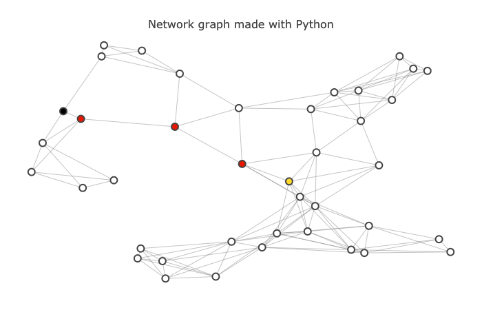

# Route Planner
## Overview
This project builds a route-planning algorithm to calculate the shortest path between two points on a map.
## Prerequisites
Python 3.7
## Configuration
1. Clone the repository: `git clone https://github.com/TianruiZhang/Route-Planner.git`
2. Switch to the repository: `cd Route-Planner`
3. Set up virtual environment with Python 3.7: `python3.7 -m venv env`
4. Activate the virtual environment: `source env/bin/activate`
5. Install required dependencies: `pip install -r requirements.txt`
6. Add the virtual environment to Jupyter Notebook: `python -m ipykernel install --name=env`
7. Open a jupyter notebook: `jupyter notebook` and open `project_notebook.ipynb`
8. When you are done, uninstall the kernel and exit the virtual environment: `jupyter kernelspec uninstall env` and `deactivate`

